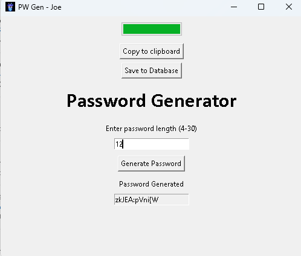

Here's a detailed README file for your password generator project. Feel free to customize it further as needed.

---

# Password Generator - Joe

## Overview

This application is a simple yet powerful password generator developed using Python's Tkinter library. It allows users to specify the desired length of a password and generates a secure, random password composed of letters, digits, and special characters. The generated password can easily be copied to the clipboard for immediate use.

## Features

- **Customizable Password Length**: Users can specify the length of the password (between 4 and 30 characters).
- **Secure Password Generation**: Utilizes Python's `secrets` module to generate high-quality random passwords.
- **Clipboard Support**: The generated password can be copied directly to the clipboard with a single click.
- **Progress Feedback**: A progress bar visually indicates the password generation process.
- **User-Friendly Interface**: Designed with a clean and intuitive GUI using Tkinter.

## Prerequisites

Before you run the application, ensure you have the following installed:

- **Python** (3.6 or higher)
- The following Python packages:
  - `tkinter` (usually included with Python)
  - `pyperclip` (can be installed via pip)

```bash
pip install pyperclip
```

## Installation

1. **Clone the Repository**: Clone this repository to your local machine using the command:

    ```bash
    git clone <repository-url>
    ```

2. **Navigate to the Project Directory**:

    ```bash
    cd Password-Generator-2.0
    ```

3. **Run the Application**: Open a terminal or command prompt, and run the Python script by executing:

    ```bash
    python PasswordGenerator.py
    ```

## Usage

1. **Launch the Application**: Run the script to open the password generator window.
   
2. **Input Password Length**: Enter the desired password length in the designated input field (must be between 4 and 30 characters).
   
3. **Generate Password**: Click the **"Generate Password"** button to create a random password.
   
4. **Copy to Clipboard**: After generating the password, click **"Copy to clipboard"** to copy it for immediate use.

5. **Clear Fields**: To reset the application, click the **"Clear"** button to clear the password and reset the length input.

## Code Structure

- **Main Application File**: `PasswordGenerator.py` - Contains the core functionality of the password generator.

### Key Functions

- `copytoclipboard()`: Copies the generated password to the clipboard.
- `validate_password_length(P)`: Validates the specified password length.
- `generate_password()`: Responsible for generating the password based on user specifications.
- `clear()`: Resets the application fields.

## Screenshot



## Troubleshooting

- **Image Loading Issues**: If the application does not load the window icon, make sure the specified path to the image file is correct and that the file is in a supported format (PNG or GIF).

- **Dependencies Missing**: If you encounter a module not found error, please ensure you have installed all required packages.

## License

This project is licensed under the MIT License - see the [LICENSE](LICENSE) file for details.

---

Feel free to add any specific details about your coding style, personal notes, or any additional information that might help users understand and use the application effectively!
